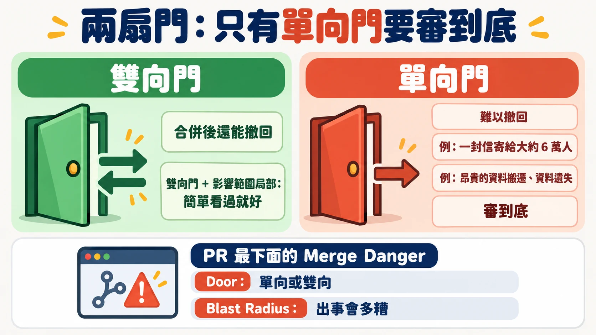
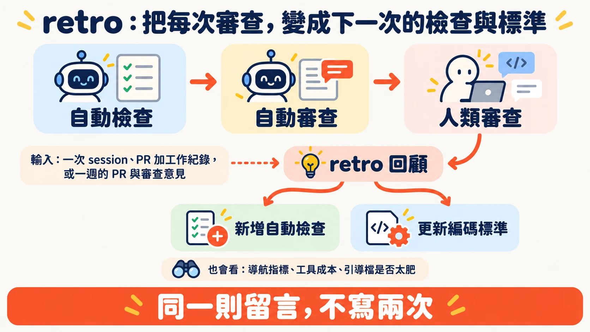

# 給軟體工廠裝三道煞車，PR 才審得完

多數團隊的 PR 早就堆著沒人看。Matt Pocock 在 AI Engineer Paris 的開場先承認這件事：沒有 AI 的年代就是如此，現在更慘，因為團隊被要求「用更少的人力做更多事」，代理人又讓 PR 的數量大幅增加。

演講標題叫 Fixing the PR Bottleneck，目標很直接：讓人類審查變快。Matt 的路徑是先用前兩層擋掉爛東西，再讓留給人的那份 PR 一眼看得懂、看得出風險。他自己點出其中的悖論：靠煞車，反而跑得更快。

> 本文依據 Matt Pocock 的演講（約 22 分鐘）、他公開的 skills 儲存庫，以及他引用的原始文件整理。凡標註「現行 repo」的內容，是 2026-10-02 查閱 GitHub 所得，演講中沒有提到。

## 軟體工廠需要煞車

Matt 對「軟體工廠」（software factory）的定義很簡單：以前工作由人發起，現在有一部分改由代理人發起。他接著用假設的語氣舉例：也許有個分類器接手，把進來的東西轉成修復或重現任務；也許接上 PlanetScale 的慢查詢報告，再觸發工廠的另一條流程。這些都由確定性的程式碼觸發，沒有人在中間。

這會讓更多程式碼湧進來。Matt 說，只踩油門的結果是一台「slop cannon」（垃圾加農砲）：大量沒人想碰、想看的爛 PR。所以要有煞車，也就是讓流程變慢、讓品質變高的機制。

他的理由是：程式碼是代理人工作的環境，爛程式碼會生出更多爛程式碼，最後變成軟體熵的惡夢。

他把煞車分成三層，像蛋糕一樣疊起來：

| 層 | 做什麼 | 成本 | 會出什麼問題 |
|---|---|---|---|
| 自動檢查 | linter、型別檢查、測試、程式碼品質指標 | 只花 CPU | 會說謊：綠燈不代表可以合併 |
| 自動審查 | 代理人讀程式碼，抓測試漏掉的、看整體結構 | 花 token | 若只留言，等於替人類增加閱讀量 |
| 人類審查 | 人看 PR | 花人力 | 最後一層，Matt 的目標是讓它變快 |

後兩層有個共同身分：Matt 稱它們是「lie detectors」，專門找出自動檢查說的謊。

## 第一道煞車：檢查很便宜，但會說謊

Matt 先替自動檢查說話：不花 token、不花人力，只花 CPU。就算測試抓到代理人寫的 bug、要花 token 修，他覺得也花得值得。他的推測是，多數人用的檢查還不夠多，也不夠有創意。

檢查怎麼說謊？Matt 給了三個從自己專案撈出來的真實例子：

- **同義反覆的測試（tautological test）。** 實作寫了 X 貼文字數上限等於 280，測試就是 expect 上限等於 280。這種測試對結構極度敏感：常數不能改值，連改名都會失敗。他說 Opus 5 對這類測試「沉迷」，自己也不懂原因，這是他的個人觀察。
- **只讀原始檔的測試。** 為了檢查畫面上兩個區塊的先後順序，測試沒有真的渲染畫面，而是把模組原始碼讀進記憶體，確認一段字出現在另一段字後面。原始碼的寫法一改，測試就壞，對程式碼結構太敏感。
- **根本不會失敗的測試。** 一個用到瀏覽器 AudioContext 的函式，測試把它整個換成假的方法。真的 AudioContext 在奇怪條件下會出錯，但測試永遠碰不到那些路徑，這類錯誤只會在正式環境才出現。

代理人沒有存心作弊，Matt 特別強調這點：它照著指示寫，只是測試跟結構綁得太緊。

導讀者補一個問法：看到綠燈時，先問兩件事：測試真的跑了程式嗎？它失敗的時候，跟使用者會遇到的問題有關嗎？

### 讓檢查更難作弊：把模組做深

Matt 的第一個解法是回頭改程式碼的設計。他引用 John Ousterhout 在《A Philosophy of Software Design》的 deep module：用很小的介面，藏住大量的實作。他拿兩種模組對比：A 是大實作藏在小介面後面；B 是介面很大、函式很多，每個函式卻沒做什麼事。（書中把 B 這類稱為 shallow module，講者沒有用這個詞。）

為什麼這樣測試會變好？介面小，內部細節藏得多，測試只要從介面走，就比較不會綁死結構。但代理人不會自動這樣做，Matt 說你的工作是強制它用那個小介面，不要伸手進實作去測奇怪的細節。

演講中他也展示了一個 skill，能掃描程式碼庫、列出「deepening modules」的機會，產出一份 HTML 文件，附重構前後對照，之後可以直接動手實作。

現行 repo：演講中沒有念出這個 skill 的名稱，依功能對照，應是 `improve-codebase-architecture`（推定），說明寫著目的是可測試性與 AI 的可導航性。

他還整理了一套 codebase design 的用語：locality 講改動集中的程度，leverage 講呼叫者用簡單呼叫換到多少價值，另外還有 seam。他的理由是各家講程式碼結構的說法太多，團隊需要一套共同語言。

## 第二道煞車：別把標準塞給實作者

整場演講最反直覺的論點在這裡。多數人想讓代理人遵守編碼標準，直覺是寫進 `AGENTS.md` 或實作者的提示詞。Matt 的建議正好相反：**不要把編碼標準放進實作代理人。**

他的推理分成實作與審查兩邊。

實作這一邊，單一脈絡視窗裡，已經要做探索（找要改的程式碼）、修改檔案、除錯與跑檢查，工作量很滿，再壓上標準，表現會變差。他的說法是實作「overloaded」。放進 `AGENTS.md` 也一樣，標準會淹沒實作者，它可能讀，也可能不讀。

審查那一邊，代理人被放在一個 sub agent 裡執行，有自己的脈絡視窗與預算。它拿到 diff，只需要做一點探索來理解上下文，不必實作也不必除錯，所以是「underloaded」，可以放心把很多標準堆給它。

因此他把寫出好程式碼拆成兩階段：先實作，讓它能動；再審查，讓它變好。他自己的類比是 red-green-refactor：一個脈絡視窗做紅燈綠燈，另一個脈絡視窗做重構。標準寫在專案裡一個叫 coding standards.md 的檔案，由你自己撰寫與調整，只有審查代理人會讀它。

現行 repo：這個檔名是 `CODING_STANDARDS.md`，屬於使用者自己的專案，不是 Matt 的 skills 儲存庫附送的檔案。

### 審查代理人要 commit，不要留言

Matt 說很多人會讓審查代理人讀完程式碼後在 PR 上留言。他認為這等於替人類審查者增加工作：人還要讀完一大串囉嗦的留言，再決定改不改。他的預設是：審查代理人直接 commit 修正，有疑問才留言。這樣人類審查時，看到的是一份已經整理過的產物。接著就是這段的主旨：Stop trying to one-shot good code，別再逼實作代理人一次就寫出好程式碼。

現行 repo：`code-review` skill 目前的做法是 Standards 與 Spec 兩軸，各派一個 sub-agent 並行審查，再把兩份報告並列呈現，沒有看到自動 commit 修正的步驟，「預設 commit」是 Matt 在演講中的主張。標準的來源除了專案自己的 `CODING_STANDARDS.md`、`CONTRIBUTING.md`，還固定帶一組出自 Fowler《Refactoring》的 code smell 基準。

### 為什麼不外包

他聊過的人，很多都說直接用第三方服務，例如 Cursor 的 Bugbot 或 CodeRabbit。Matt 自己試過做通用的 code review skill，要找 bug、做安全審查，結果不是太籠統而充滿與專案無關的誤報，就是太特定（只管 TypeScript）而其他人用不了。所以他建議自己建，長期累積編碼標準，在團隊內共用；手邊那些沒人讀的文件，也可以搬進來。

## 第三道煞車：讓人類審查更快看懂

走到人手上，Matt 想做的是縮短「看懂」的時間，並判斷哪些 PR 不必細看。他的 `pr` skill 當時還在進行中，他坦白說還沒搞清楚這類做法的最佳解，所以乾脆偷各家最好的點子，打算之後釋出。

### 兩扇門：只有單向門要審到底

他的第一個原則是：不是每個 PR 都同等重要。他借用 Amazon 的「one-way door／two-way door」概念。Jeff Bezos 在 [2015 年致股東信](https://s2.q4cdn.com/299287126/files/doc_financials/annual/2015-Letter-to-Shareholders.PDF)裡，把幾乎不可逆的決策稱為 Type 1，也就是 one-way door，需要慎重、緩慢地決定；可逆的決策是 Type 2，也就是 two-way door，可以快速決定。信裡還點出一個常見毛病：組織變大之後，容易把重量級的 Type 1 流程套在大多數決策上，結果是變慢、不敢冒險。Matt 在演講中說這是 AWS 的用語，原始出處是 Amazon 的這封信。

多數 PR 是 two-way door，合併後還能撤回，這是軟體工程師相對土木工程師的福氣。但他提醒要小心：一個看似簡單的改動，可能不小心把一封信寄給大約 6 萬人，那就變成 one-way door；涉及昂貴的資料搬遷或資料遺失的，也一樣。這類 PR 要「審到底」。

他同時要看 blast radius（爆炸半徑）：出事的話會多糟。所以他的每個 PR 最下面都有一段 Merge Danger，標明是哪種門、影響範圍多大。看到「two-way door、局部」，他就知道不用太費神，簡單看過就好。他的結論是，不需要審每一個 two-way door，每一個 one-way door 則都要審。

現行 repo：他的 `pr` skill 範本由三段組成：Summary、Evidence（改前改後的截圖、輸出或測試結果），以及 Merge Danger（門的種類與 blast radius）。

### 用圖與偽程式碼說明在改什麼

第二個原則是讓人最快理解「為什麼改」。Matt 試過很多方法，最好用的是偽程式碼與圖。他特別感謝 HumanLayer 的 Dex Horthy 做的 `show-me` skill，它盡量少用文字，改用 Mermaid 圖、UML 和簡單的草圖呈現變更。他舉的簡單例子是：一個 CLI 新增了一個指令、多了兩個旗標，用一張小圖就看懂。

現行 repo：`pr` skill 的檔案開頭，就標註了 show-me 的來源與作者。

### 審的是產生程式碼的系統

第三個原則談的是流程本身。Matt 說，現在團隊都圍繞同樣的 skill 檔與引導檔協作，等於一起替代理人打造工作環境，所以產生程式碼的流程，跟程式碼本身同樣重要。人類審查時，審的其實是那個系統。

他由此推出一個目標：同一則留言不要寫兩次，同一種錯誤不要在兩個 PR 裡抓到兩次。

### 複利：retro

要達到這個目標，他做了一個新的 skill，叫 `retro`。你可以拿一次代理人的工作紀錄、一個 PR 加上它的工作紀錄，或過去一週所有 PR 與審查意見，請它做回顧。它會提出改進代理人工作環境的建議，包含：

- 該新增哪些自動檢查
- 編碼標準該怎麼增刪
- 導航：代理人要花多久才找到資訊，`AGENTS.md` 裡能不能放個指標
- 工具成本：哪些工具呼叫特別耗 token
- 引導檔與 skill 是否太肥

他說這是一種複利：這一次人類審查做得好，下一次審查的品質就更高，自己也少做一點事。

現行 repo：retro 把違規分成機械式與判斷式。屬於固定語法樣式、禁用 API 這類機械式問題，優先寫成確定性的檢查（linter 規則、pre-commit hook 或 CI）；只有真正需要判斷的，才寫進 `CODING_STANDARDS.md`。

## 重點結論與實際啟示

### 先留意三件事

- 演講的論點多半來自 Matt 的個人經驗，沒有對照實驗。「實作者負擔過重、審查者負擔較輕」是有道理的推論，仍待在自己的專案驗證。
- 他是這些 skill 的作者，演講也在介紹它們。想採用前，建議先讀 skill 檔案本身，再決定要不要照單全收。
- 版本：演講結尾他說這週要出 v1.3。上游在演講後的 2026 年 9 月 29 日合併了 release/v1.3 的 PR，標題寫明 graduate（升格）`implement-spec`、`pr`、`retro`，內文顯示它們是從 in-progress 目錄移到 engineering 目錄；但在 10 月 2 日查詢時，套件版本號、Releases 與 Tags 頁最新都還是 v1.2.3。想用的話，以儲存庫現況為準。

### 帶得走的四件事

- 看到綠燈，先確認測試真的跑了程式，而且失敗時跟使用者遇到的問題有關。
- 把編碼標準放到審查代理人，不放進實作代理人；審查代理人預設直接 commit 修正（這是 Matt 的主張，現行 code-review skill 只出報告）。
- PR 最下面標出是哪種門、影響多大，讓審查者知道把力氣花在哪裡。
- 把每次審查的發現，用 retro 轉成下一次的檢查與標準。

## 來源清單

**影片與活動**

- [Fixing the PR Bottleneck — Matt Pocock, AIHero](https://www.youtube.com/watch?v=LlgiOCmFG_w)（頻道 AI Engineer，2026-09-26 發布（臺北時間），約 22 分鐘）
- [AI Engineer Paris 2026 議程](https://ai.engineer/paris/2026)

**Matt Pocock 的 skills（GitHub 原始檔，現行 repo）**

- [mattpocock/skills 儲存庫](https://github.com/mattpocock/skills)
- [improve-codebase-architecture](https://github.com/mattpocock/skills/blob/main/skills/engineering/improve-codebase-architecture/SKILL.md)
- [code-review](https://github.com/mattpocock/skills/blob/main/skills/engineering/code-review/SKILL.md)
- [pr](https://github.com/mattpocock/skills/blob/main/skills/engineering/pr/SKILL.md)
- [retro](https://github.com/mattpocock/skills/blob/main/skills/engineering/retro/SKILL.md)

**引用的原始出處**

- [HumanLayer：show-me skill](https://github.com/humanlayer/skills/blob/main/plugins/show-me/skills/show-me/SKILL.md)（Dex Horthy）
- [Amazon 2015 Letter to Shareholders（Jeff Bezos）](https://s2.q4cdn.com/299287126/files/doc_financials/annual/2015-Letter-to-Shareholders.PDF)
- [John Ousterhout：A Philosophy of Software Design](https://web.stanford.edu/~ouster/cgi-bin/book.php)
